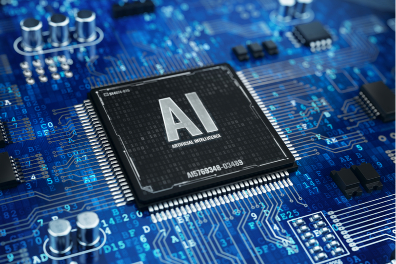

I. Introduction
Artificial intelligence is a booming new tech field that uses machine learning to generate solutions to problems
using search methods to reach the best possible outcome most of the time. In this way people have used it to 
generate intelligent randomized behavior for things in games, or even developing code. AI has helped in a sense
that it can do a lot of our jobs for us.

II. Personal Experience with AI 
1.Experience WODs e.g. E18 
2.In-class Practice WODs 
3.In-class WODs 
4.Essays 
5.Final project 
6.Learning a concept / tutorial 
7.Answering a question in class or in Discord 
8.Asking or answering a smart-question 
9.Coding example e.g. “give an example of using Underscore .pluck” 
10.Explaining code 
11.Writing code 
12.Documenting code 
13.Quality assurance e.g. “What’s wrong with this code <code here>” or “Fix the ESLint errors in <code here>” 
14.Other uses in ICS 314 not listed 
  
The list above will be addressed with if I used or did not use AI in ICS314 and my reasoning. Starting off with WODs
experience, practice, and the actual on the list; which I did not use any AI. I feel like I learn to code better first
hand than using AI to code for me. This applies for everything on the list. As for the essays I write them all out on my own
as well due to being able to write in my own tone. Learning a concept is better for me without AI, the same reasoning for the WODs 
apply to this. As for answering questions in class or discord; I have not found a reason to use AI. The same applies 
to smart questions. As for coding examples; I have used documentations online instead. Explaining, writing, and documentation
of code is done all by me as well so I can learn the coding language better. As for quality assurance I found that me
fixing the problem myself has helped me get a better grasp of the syntax. Other than that there has been no uses of AI
done by me.

III. Impact on Learning and Understanding
AI has an impact on learning in the way that a calculator does not help kids learn basic arithmatic. It is certainly 
helpful to get things done though. This is the same reasoning I stated earlier on why I did not use it for this class.

IV. Practical Applications
Practical applicattions for AI outside of ICS314 are numerous. Many image generators are being used to create art, even
music can be made at this time using AI to copy peoples voices. Games, weather prediction, image recognition, etc.

V. Challenges and Opportunities
I have not encountered any challenges using AI in this class as of yet. I can imagine certain scenarios though where 
chatGPT could write a code too complicated for some of the WODs or homeworks. As for opportunities; I can see AI being 
used like scientific calculators in the future for certain software engineering classes to help develop code.

VI. Comparative Analysis
A comparative analysis for traditional teaching and the usage of AI would be that engagement would be a hit or miss 
depending on the student. As for knowledge retentions traditional teach would help as it would be easier to skim over
coding language syntax by just using an AI to code. This ties into practical skill development too as with AI no skills
would be developed other than understanding how to use the AI.

VII. Future Considerations
AI in software engineering is inevitable in my opinion. Either for educational purposes or jobs AI is a useful tool. There
are challenges in that AI may use too much energy, as machine learning and repeated cycles of searches to develop the AI take
a lot of energy. Energy would be my biggest concern and the best improvement for AI in my opinion.

VIII. Conclusion
In conclusion I feel that AI is useful and would help a lot with this class, but traditional learning would still be needed.
This is so students can recognize what is going on with the code if certain issues arise. 
