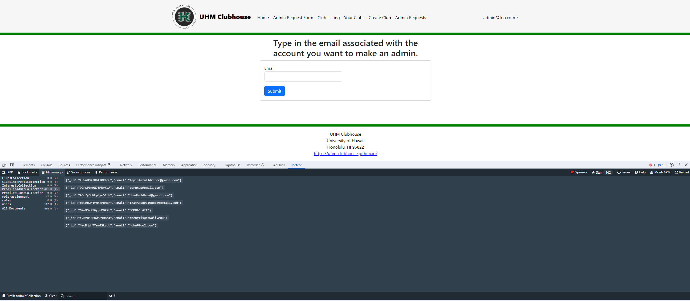

## University of Hawaii Clubhouse Web Application

  

[UHM Clubhouse](https://uhm-clubhouse.xyz/) is a web application designed by me and five other members of our final project group. It is designed to be a database for all the clubs at UH Manoa with a target audience that consist of students looking to find a club right for them. The bases was to make it usable by allowing users to bookmark and save the clubs they are interested in while also allowing admins to create clubs and edit their existing ones; admins being the club presidents.

To make someone an admin an application needs to be made on the site where a "super admin" will then change their roles from the server side of the application.

## Role and Contribution
The team members were me ,Keiko, Iverson, Lizyl, Delsin, and Miki with each person working on separate parts of the project. Our project was organized using Github with the project assignments for each member located [here](https://github.com/orgs/uhm-clubhouse/projects). The assignments were split into three separate milestones; [1](https://github.com/orgs/uhm-clubhouse/projects/2), [2](https://github.com/orgs/uhm-clubhouse/projects/5), and [3](https://github.com/orgs/uhm-clubhouse/projects/6).

I specifically worked on routing the pathways for the pages, setting roles to users and using outside applications such as Studio3t and DigitalOcean to deploy our page.

  

  

I also made the application page for admin request to help the super admins keep track of who wants to be admin by making a collection that took in strings in the form of emails. Along with setting roles I made it where certain roles can only see certain pages by setting up the navbar to take in access to only admin and super admin for some pages.

  

 

## Learning Experience
Overall, I enjoyed working with others to brainstorm, exchange ideas, debug, and code together to create a fully functional web application. Although it is not my first time working in a team and using an organizational tool such as the GitHub organization and project boards, I was able to further develop my skills as a software engineer. In terms of soft skills, I learned how to take initiative, lead my team by leveraging my strengths, and effectively communicate with others. Software engineering is not all about good programming skills, after all. However, I was also able to challenge myself by using Javascript, React, Meteor, and MongoDB to implement features and functions I had never experienced before, such as the filter and search functions. Through this experience, I learned the importance of efficient web searching and the appropriate usage of Artificial Intelligence to aid in developing software.
