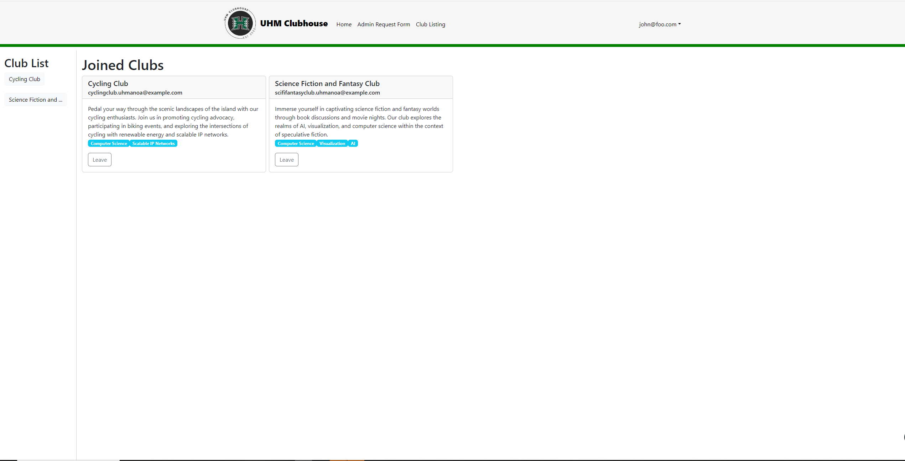
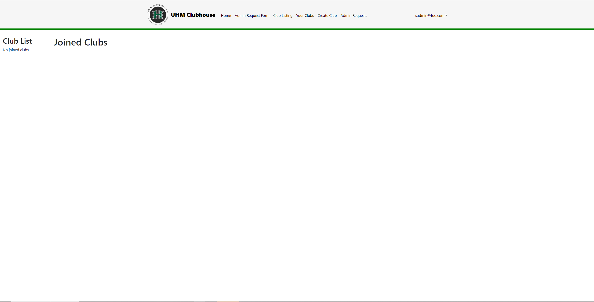

## University of Hawaii Clubhouse Web Application

  

[UHM Clubhouse](https://uhm-clubhouse.xyz/) is a web application designed by me and five other members of our final project group. It is designed to be a database for all the clubs at UH Manoa with a target audience that consist of students looking to find a club right for them. The bases was to make it usable by allowing users to bookmark and save the clubs they are interested in while also allowing admins to create clubs and edit their existing ones; admins being the club presidents.

To make someone an admin an application needs to be made on the site where a "super admin" will then change their roles from the server side of the application.

## Role and Contribution
The team members were me ,Keiko, Iverson, Lizyl, Delsin, and Miki with each person working on separate parts of the project. Our project was organized using Github with the project assignments for each member located [here](https://github.com/orgs/uhm-clubhouse/projects). The assignments were split into three separate milestones; [1](https://github.com/orgs/uhm-clubhouse/projects/2), [2](https://github.com/orgs/uhm-clubhouse/projects/5), and [3](https://github.com/orgs/uhm-clubhouse/projects/6).

I specifically worked on routing the pathways for the pages, setting roles to users and using outside applications such as Studio3t and DigitalOcean to deploy our page.

  

  

I also made the application page for admin request to help the super admins keep track of who wants to be admin by making a collection that took in strings in the form of emails. Along with setting roles I made it where certain roles can only see certain pages by setting up the navbar to take in access to only admin and super admin for some pages.

  

 

## Learning Experience
The project itself was a good firsthand experience on how to program an application as a group. I found that organization and the work ethics of the team made the process to design the web application smooth. Coding standards and Eslint allowed all of us to look over eachothers codes to link everything together well. I feel that this has helped me to get better at communicating with my team members in a way that has helped progress development. I also learned how using different user interface frameworks can be used together to mold our application in a better way than only using one. I feel this has helped me develop skills to work in team environments in the job field and boosted my communication skills.
